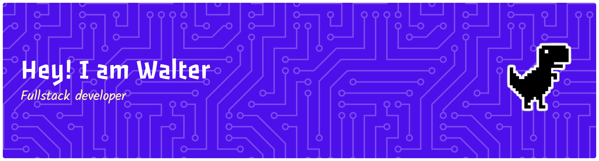

## Hi there 👋

###

<picture>
  <source media="(prefers-color-scheme: dark)" srcset="https://raw.githubusercontent.com/Dolly-021/Dolly-021/output/pacman-contribution-graph-dark.svg">
  <source media="(prefers-color-scheme: light)" srcset="https://raw.githubusercontent.com/Dolly-021/Dolly-021/output/pacman-contribution-graph.svg">
</picture>

###

###
<!--
**Dolly-021/Dolly-021** is a ✨ _special_ ✨ repository because its `README.md` (this file) appears on your GitHub profile.

Here are some ideas to get you started:
- 🌱 I’m currently learning ...
- 👯 I’m looking to collaborate on ...
- 🤔 I’m looking for help with ...
- 💬 Ask me about ...
- 📫 How to reach me: ...
- 😄 Pronouns: ...
- ⚡ Fun fact: ...
-->
🔭 I’m currently learning on 
## USU

## 🌟 About Me

> **Fourth-semester Information Technology student** at **Universitas Sumatera Utara** passionate about Networking, Cybersecurity, Artificial Intelligence, and building digital products that solve real problems.

---

## 🛠 Tech Stack

**Languages & Web**

**Database**

